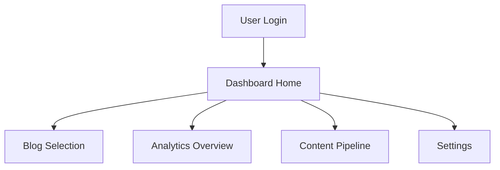
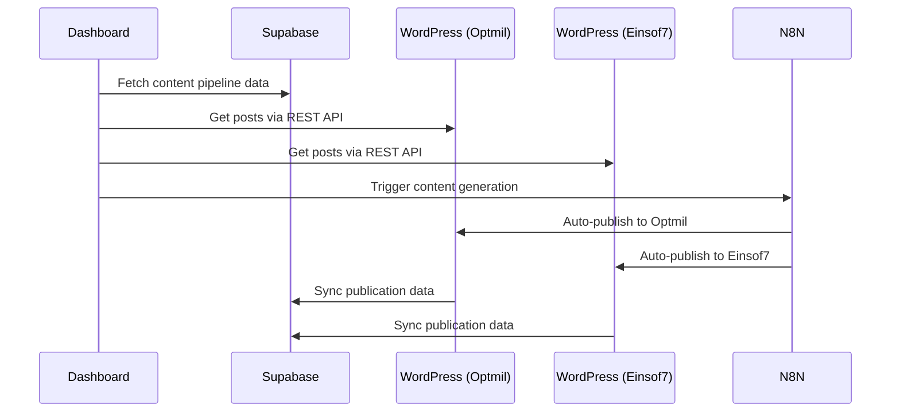
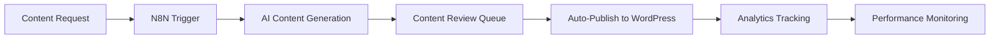
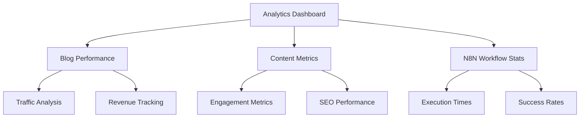
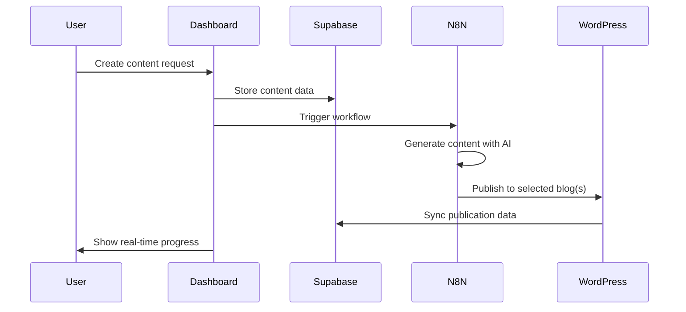
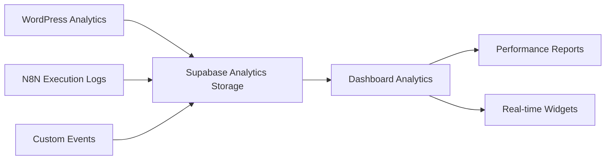

# WordPress SaaS Dashboard - Product Requirement Document (PRD)

## Executive Summary

A comprehensive React-based dashboard for managing a WordPress content generation SaaS platform. The system integrates Supabase database, N8N workflow automation, and multiple WordPress blog APIs (Optmil and Einsof7) to provide full control over content production, publication, and analytics.

### Core Value Proposition
- **Unified Control Center**: Single dashboard for multi-blog WordPress management
- **Intelligent Content Pipeline**: N8N-powered automation for content generation and publication
- **Real-time Analytics**: Comprehensive metrics and performance tracking
- **Scalable Architecture**: Built for multi-tenant, multi-blog operations

## Problem Statement & Solution

### Current Pain Points
1. **Fragmented Management**: Content creation scattered across multiple platforms
2. **Manual Processes**: Repetitive tasks lacking automation
3. **Limited Visibility**: No centralized analytics or performance tracking
4. **Scalability Issues**: Difficult to manage multiple WordPress blogs efficiently

### Solution Architecture
A React + TypeScript dashboard with:
- **Supabase Integration**: Full REST API access to production database
- **WordPress Multi-Blog Support**: Seamless management of Optmil and Einsof7 blogs
- **N8N Workflow Integration**: Automated content generation and publication pipelines
- **Real-time Dashboard**: Live metrics and operational controls

## User Stories & Requirements

### Epic 1: Dashboard Core & Authentication



#### Story 1.1: Authentication & Session Management
**As a** SaaS administrator
**I want** secure authentication with Supabase Auth
**So that** I can access the dashboard safely

**Acceptance Criteria:**
- [ ] Login/logout with Supabase Auth
- [ ] Session persistence across browser refreshes
- [ ] Role-based access control (admin/user)
- [ ] Secure token management

#### Story 1.2: Multi-Blog Dashboard
**As a** content manager
**I want** to see all my WordPress blogs in one view
**So that** I can quickly switch between different properties

**Acceptance Criteria:**
- [ ] Blog selector with Optmil and Einsof7 options
- [ ] Real-time blog status indicators
- [ ] Quick stats for each blog (posts, views, revenue)
- [ ] Context switching without page reload

### Epic 2: Content Management & WordPress Integration



#### Story 2.1: WordPress Content Management
**As a** content creator
**I want** to manage WordPress posts from the dashboard
**So that** I can control content across multiple blogs efficiently

**Acceptance Criteria:**
- [ ] List all posts from both WordPress blogs
- [ ] Create/edit/delete posts via WordPress REST API
- [ ] Bulk operations (publish, draft, delete)
- [ ] Category and tag management
- [ ] Media library integration
- [ ] Preview functionality

#### Story 2.2: Multi-Blog Content Synchronization
**As a** content strategist
**I want** centralized content planning and publication
**So that** I can coordinate content across all properties

**Acceptance Criteria:**
- [ ] Content calendar with multi-blog view
- [ ] Cross-blog content scheduling
- [ ] Duplicate detection and management
- [ ] Content performance comparison
- [ ] SEO optimization suggestions

### Epic 3: N8N Workflow Integration



#### Story 3.1: Workflow Management
**As a** automation manager
**I want** to control N8N workflows from the dashboard
**So that** I can manage content generation pipelines

**Acceptance Criteria:**
- [ ] List all active N8N workflows
- [ ] Start/stop/pause workflow execution
- [ ] Workflow performance monitoring
- [ ] Error handling and retry mechanisms
- [ ] Workflow template management

#### Story 3.2: Content Generation Pipeline
**As a** content producer
**I want** automated content generation and publication
**So that** I can scale content production efficiently

**Acceptance Criteria:**
- [ ] Trigger content generation workflows
- [ ] Monitor generation progress in real-time
- [ ] Review generated content before publication
- [ ] Automated SEO optimization
- [ ] Multi-format content support (posts, pages, custom types)

### Epic 4: Analytics & Performance Monitoring



#### Story 4.1: Comprehensive Analytics
**As a** business owner
**I want** detailed analytics across all platforms
**So that** I can make data-driven decisions

**Acceptance Criteria:**
- [ ] Traffic analytics from WordPress blogs
- [ ] Content performance metrics
- [ ] N8N workflow execution statistics
- [ ] Revenue and conversion tracking
- [ ] Custom dashboard widgets
- [ ] Export functionality for reports

## Technical Architecture

### System Components

```mermaid
graph TB
    subgraph "Frontend (React + Vite + TS)"
        A[Dashboard UI]
        B[Authentication]
        C[API Client]
        D[State Management]
    end
    
    subgraph "Backend Services"
        E[Supabase API]
        F[WordPress REST API (Optmil)]
        G[WordPress REST API (Einsof7)]
        H[N8N API]
    end
    
    subgraph "Database"
        I[Supabase PostgreSQL]
        J[WordPress MySQL (Optmil)]
        K[WordPress MySQL (Einsof7)]
    end
    
    A --> C
    C --> E
    C --> F
    C --> G
    C --> H
    E --> I
    F --> J
    G --> K
```

### Database Schema Integration

Based on existing Supabase tables:

```typescript
// Core entities from existing schema
interface Blog {
  id: string;
  name: string;
  domain: string;
  niche: string;
  description: string;
  settings: JsonB;
  is_active: boolean;
  created_at: DateTime;
  updated_at: DateTime;
}

interface ContentPost {
  id: string;
  blog_id: string;
  title: string;
  content: string;
  status: 'draft' | 'published' | 'scheduled';
  wordpress_post_id?: number;
  seo_data: JsonB;
  performance_metrics: JsonB;
  created_at: DateTime;
  published_at?: DateTime;
}

interface ProductionPipeline {
  id: string;
  blog_id: string;
  workflow_name: string;
  n8n_workflow_id: string;
  status: 'active' | 'paused' | 'error';
  last_execution: DateTime;
  success_rate: number;
  configuration: JsonB;
}
```

### API Integration Specifications

#### Supabase Integration
```typescript
// Environment variables
VITE_SUPABASE_URL=https://wayzhnpwphekjuznwqnr.supabase.co
VITE_SUPABASE_ANON_KEY=eyJhbGciOiJIUzI1NiIsInR5cCI6IkpXVCJ9...

// Key endpoints to implement
const supabaseEndpoints = {
  blogs: '/rest/v1/blogs',
  content_posts: '/rest/v1/content_posts',
  analytics_metrics: '/rest/v1/analytics_metrics',
  production_pipeline: '/rest/v1/production_pipeline',
  keyword_opportunities: '/rest/v1/keyword_opportunities'
};
```

#### WordPress REST API Integration
```typescript
// Optmil Blog Configuration
VITE_WORDPRESS_OPTMIL_URL=https://optmil.com
VITE_WORDPRESS_OPTMIL_USERNAME=username
VITE_WORDPRESS_OPTMIL_PASSWORD=app-password

// Einsof7 Blog Configuration  
VITE_WORDPRESS_EINSOF7_URL=https://einsof7.com
VITE_WORDPRESS_EINSOF7_USERNAME=username
VITE_WORDPRESS_EINSOF7_PASSWORD=app-password

// WordPress REST API endpoints
const wordpressEndpoints = {
  posts: '/wp-json/wp/v2/posts',
  pages: '/wp-json/wp/v2/pages',
  categories: '/wp-json/wp/v2/categories',
  tags: '/wp-json/wp/v2/tags',
  media: '/wp-json/wp/v2/media',
  users: '/wp-json/wp/v2/users'
};

// Authentication method: Application Passwords (Basic Auth)
```

#### N8N API Integration
```typescript
// N8N Configuration
VITE_N8N_API_URL=https://your-n8n-instance.com
VITE_N8N_API_KEY=your-api-key
VITE_N8N_WEBHOOK_URL=https://your-n8n-instance.com/webhook

// Key N8N capabilities to integrate
const n8nCapabilities = {
  workflows: 'Manage 400+ integrations',
  aiAgents: 'AI-powered content generation',
  batchProcessing: 'Bulk content operations',
  errorHandling: 'Robust retry mechanisms',
  realTimeMonitoring: 'Workflow execution tracking'
};
```

## Implementation Blueprint

### Phase 1: Foundation Setup (Week 1-2)

```typescript
// 1. Project Setup
npx create-vite@latest wordpress-saas-dashboard --template react-ts
cd wordpress-saas-dashboard
npm install @supabase/supabase-js @tanstack/react-query
npm install @headlessui/react @heroicons/react tailwindcss
npm install react-router-dom axios date-fns

// 2. Environment Configuration
cp .env.example .env.local
// Configure all API endpoints and keys

// 3. Basic Authentication Setup
// components/auth/AuthProvider.tsx
// hooks/useAuth.ts
// utils/supabase.ts
```

### Phase 2: Core Dashboard (Week 3-4)

```typescript
// 4. Dashboard Layout
// components/layout/DashboardLayout.tsx
// components/navigation/Sidebar.tsx
// components/navigation/TopBar.tsx

// 5. Blog Management
// pages/BlogDashboard.tsx
// components/blogs/BlogSelector.tsx
// components/blogs/BlogStats.tsx
// hooks/useBlogs.ts

// 6. WordPress Integration
// services/wordpress.ts
// hooks/useWordPressAPI.ts
// components/content/PostManager.tsx
```

### Phase 3: Content Management (Week 5-6)

```typescript
// 7. Content Pipeline
// components/content/ContentPipeline.tsx
// components/content/PostEditor.tsx
// services/contentManagement.ts

// 8. Multi-Blog Operations
// utils/multiBlogOperations.ts
// components/content/BulkOperations.tsx
// hooks/useMultiBlogSync.ts
```

### Phase 4: N8N Integration (Week 7-8)

```typescript
// 9. Workflow Management
// services/n8n.ts
// components/workflows/WorkflowManager.tsx
// hooks/useN8NWorkflows.ts

// 10. Automation Controls
// components/automation/TriggerControls.tsx
// components/automation/WorkflowMonitor.tsx
// utils/workflowExecution.ts
```

### Phase 5: Analytics & Optimization (Week 9-10)

```typescript
// 11. Analytics Dashboard
// components/analytics/AnalyticsDashboard.tsx
// components/charts/PerformanceCharts.tsx
// hooks/useAnalytics.ts

// 12. Real-time Monitoring
// services/realTimeData.ts
// components/monitoring/LiveStats.tsx
// utils/websocketConnection.ts
```

## Data Flow Architecture

### Content Creation Flow


### Analytics Data Flow


## Validation Loop

### Level 1: Development Setup
```bash
# Syntax & Type Checking
npm run type-check
npm run lint
npm run build

# Environment Validation
curl -H "Authorization: Bearer $VITE_SUPABASE_ANON_KEY" \
  "$VITE_SUPABASE_URL/rest/v1/blogs"
```

### Level 2: API Integration Tests
```bash
# WordPress REST API Connection
curl --user "$WP_USERNAME:$WP_PASSWORD" \
  "https://optmil.com/wp-json/wp/v2/posts?per_page=1"

curl --user "$WP_USERNAME:$WP_PASSWORD" \
  "https://einsof7.com/wp-json/wp/v2/posts?per_page=1"

# N8N API Connection
curl -H "X-N8N-API-KEY: $N8N_API_KEY" \
  "$N8N_API_URL/api/v1/workflows"
```

### Level 3: Feature Testing
```bash
# Start development server
npm run dev

# Test authentication flow
# Test blog data fetching
# Test content CRUD operations
# Test N8N workflow triggers
```

### Level 4: Integration Validation
```bash
# End-to-end content pipeline test
# Multi-blog synchronization test
# Real-time analytics verification
# Error handling and recovery test
```

## Risk Assessment & Mitigation

### Technical Risks

| Risk | Impact | Probability | Mitigation |
|------|---------|------------|------------|
| **WordPress API Rate Limits** | High | Medium | Implement request queuing and retry logic |
| **Supabase Connection Issues** | High | Low | Add connection pooling and offline capabilities |
| **N8N Workflow Failures** | Medium | Medium | Robust error handling and manual fallbacks |
| **Authentication Token Expiry** | Medium | High | Automatic token refresh mechanisms |

### Business Risks

| Risk | Impact | Probability | Mitigation |
|------|---------|------------|------------|
| **Multi-Blog Content Conflicts** | Medium | Medium | Content deduplication and conflict resolution |
| **Performance at Scale** | High | Medium | Implement pagination and lazy loading |
| **Data Consistency Issues** | High | Low | Add data validation and reconciliation |

## Success Metrics

### Technical KPIs
- **API Response Times**: < 500ms for dashboard loads
- **Content Publication Success Rate**: > 99%
- **System Uptime**: > 99.9%
- **WordPress Integration Success**: > 95%

### Business KPIs
- **Content Production Efficiency**: 10x increase in content throughput
- **Multi-Blog Management Time**: 80% reduction in management overhead
- **Automation Success Rate**: > 90% for N8N workflows
- **User Satisfaction Score**: > 4.5/5

## Implementation Phases Summary

### MVP (Minimum Viable Product) - Weeks 1-6
- Authentication and basic dashboard
- WordPress API integration for both blogs
- Basic content management (CRUD operations)
- Supabase data integration

### Enhanced Features - Weeks 7-8
- N8N workflow integration
- Automated content generation
- Multi-blog synchronization

### Advanced Analytics - Weeks 9-10
- Comprehensive analytics dashboard
- Real-time performance monitoring
- Advanced reporting capabilities

## Conclusion

This PRD provides a comprehensive roadmap for building a sophisticated WordPress SaaS dashboard that unifies content management across multiple blogs while leveraging N8N automation and Supabase analytics. The phased approach ensures incremental value delivery while building toward a fully-featured content management platform.

The system's architecture supports scalability, real-time operations, and robust error handling - essential for a production SaaS environment. With proper implementation of the validation loops and risk mitigation strategies, this dashboard will significantly improve content production efficiency and multi-blog management capabilities.